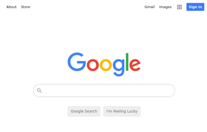

# google-homepage

This is a project to create a visual clone of the standard Google homepage. It originates from [Frontend Practice](https://www.frontendpractice.com/).

## Links 

- Live Site URL: [https://loganwoolf.github.io/google-homepage/](https://loganwoolf.github.io/google-homepage/)

## Screenshots

## Author

Created by Logan Woolf
- Twitter: [@logan__woolf](https://twitter.com/logan__woolf/)
- GitHub: [loganwoolf](https://loganwoolf.github.io/)